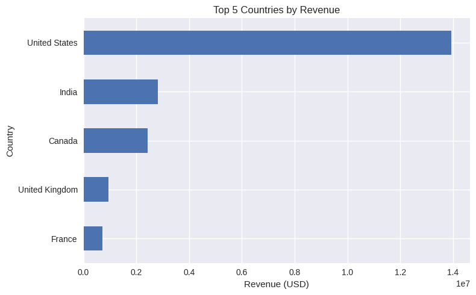
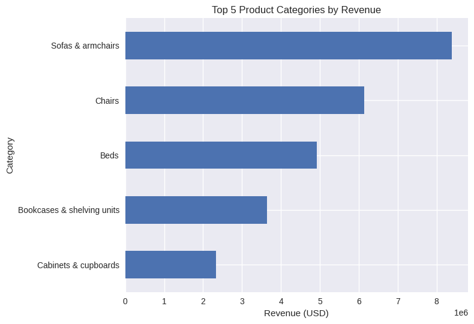

# 📊 Sales Analytics – BigQuery & Python Project


## 🔎 Project Overview
This project analyzes sales data using **Google BigQuery (SQL)** and **Python (Pandas, Matplotlib)**.  
The goal is to identify revenue trends across continents, countries, and product categories.


## 🛠 Tech Stack
- Google BigQuery (SQL)
- Python
- Pandas
- Matplotlib
- Google Colab

## 🗄 SQL Data Extraction

The dataset was built using a multi-table JOIN query in BigQuery, combining:

- orders
- sessions
- session parameters
- products
- account data

The full SQL query is available in:

sql/sales_dataset_query.sql

## 📂 Dataset Structure
The dataset includes:

- Orders
- Sessions
- Session parameters
- Products
- Accounts

The final dataset contains:
- Order date
- Product details
- User information
- Traffic source
- Revenue

---

## 📈 Key Analysis

### 🌍 Revenue by Continent
The Americas represent the primary revenue driver, significantly outperforming other regions.
This suggests strong market penetration and demand concentration in this region.
Asia and Europe follow at a moderate distance, indicating potential for strategic expansion and market optimization.

### 🌎 Top 5 Countries by Revenue
The United States dominates revenue generation by a substantial margin.
India and Canada form a secondary tier, while the United Kingdom and France contribute comparatively smaller shares.
This distribution highlights the dependency on the US market and potential risk concentration.

### 🛋 Top Product Categories
"Sofas & armchairs" generate the highest revenue, followed by Chairs and Beds.
Large furniture categories drive the majority of sales performance, while storage-related products contribute moderately.
This suggests customer demand is concentrated around high-value household essentials.

---

## 📊 Visualizations
The project includes:
- Bar charts for top countries by revenue
- Bar charts for top product categories
- Aggregated revenue analysis

---

## 🚀 How to Run

1. Clone the repository
2. Install requirements:
   ```bash
   pip install -r requirements.txt

## 📊 Visualizations

### 🌍 Top 5 Countries


### 🛋️ Top 5 Categories

